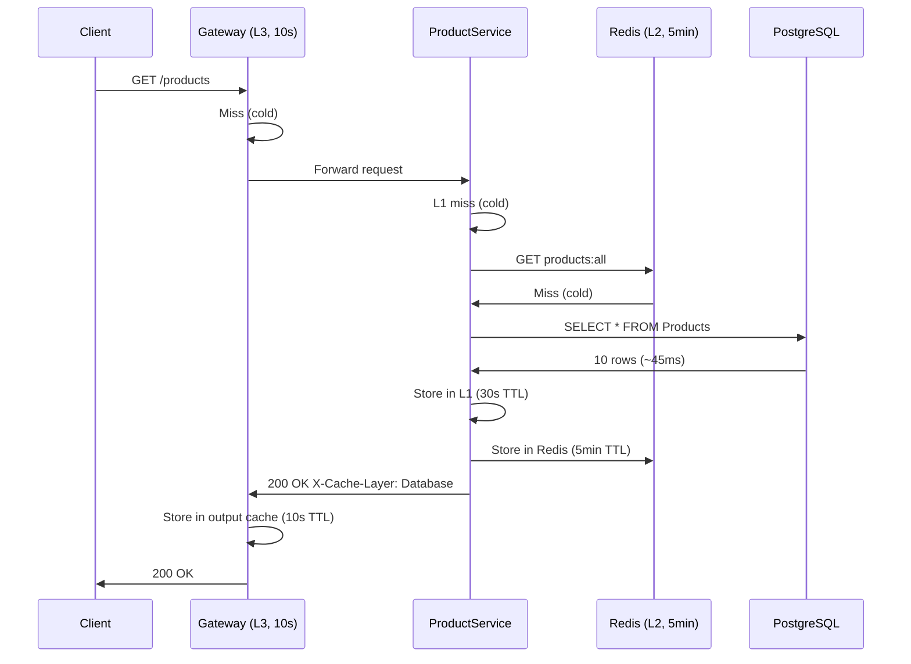
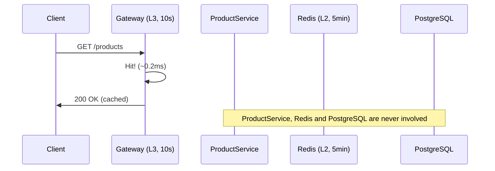
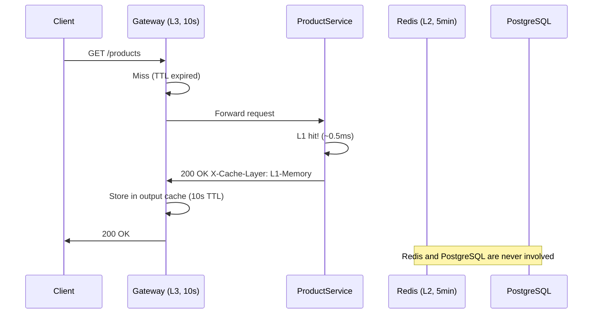
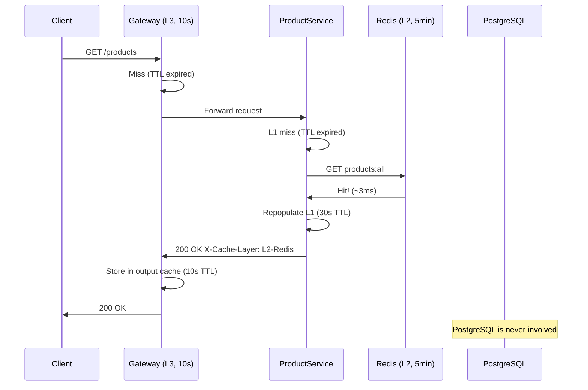
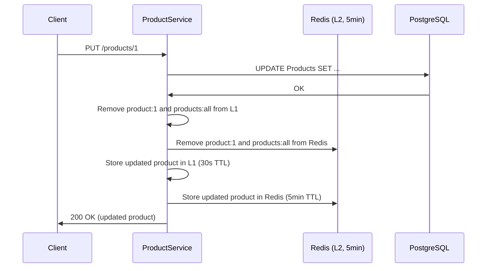

# Cache Flow Diagrams

Each diagram shows exactly which components are involved for a given cache state.

---

## Scenario 1: Cold start

All caches are empty. The request travels all the way through every layer down to PostgreSQL.

---

## Scenario 2: Gateway cache hit

A request comes in within 10 seconds of the previous one. The gateway returns its cached response without involving ProductService at all.

---

## Scenario 3: L1 memory cache hit

The gateway TTL has expired (10s passed) but ProductService still has the data in memory (within 30s). The request reaches ProductService but stops there.

---

## Scenario 4: L2 Redis cache hit

L1 memory has expired (30s passed) but Redis still has the data (within 5min). ProductService repopulates L1 from Redis, no database call needed.

---

## Cache invalidation on update

When a product is updated via PUT, both L1 and L2 are invalidated immediately so the next request gets fresh data.

